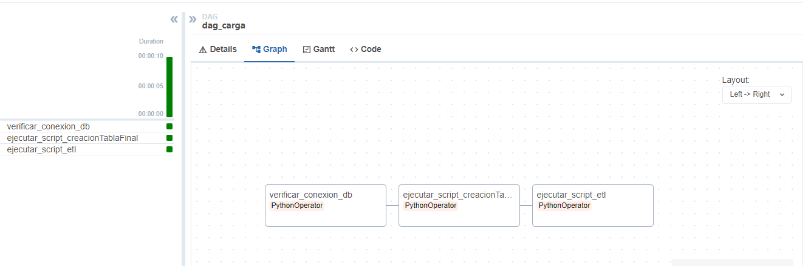

# Clima Airflow Data

Este proyecto utiliza Apache Airflow para orquestar la carga de datos meteorológicos en una base de datos PostgreSQL.

## Estructura del Proyecto

El proyecto contiene los siguientes componentes principales:

1. **DAGs**: Definición de las tareas y su flujo de trabajo.
   
2. **Scripts de Conexión y ETL**: Scripts para la conexión a la base de datos y el procesamiento de datos.
   
   
3. **Configuración**: Archivos de configuración necesarios para conectar y manejar la base de datos.

## Contenido

### DAG: `dag_carga`

Este DAG se encarga de la carga de datos de temperatura desde una fuente de datos externa a una base de datos PostgreSQL.

**Archivo**: `dags_carga.py`

#### Tareas del DAG:

1. **verificar_conexion_db**:
   - Verifica la conexión a la base de datos.
   - **Función**: `verificar_conexion`

2. **ejecutar_script_creacionTablaFinal**:
   - Ejecuta el script para crear la tabla final en la base de datos.
   - **Función**: `ejecutar_initialize_tables`

3. **ejecutar_script_etl**:
   - Ejecuta el script ETL para cargar los datos de mediciones de temperatura.
   - **Función**: `ejecutar_load_measuments_data`